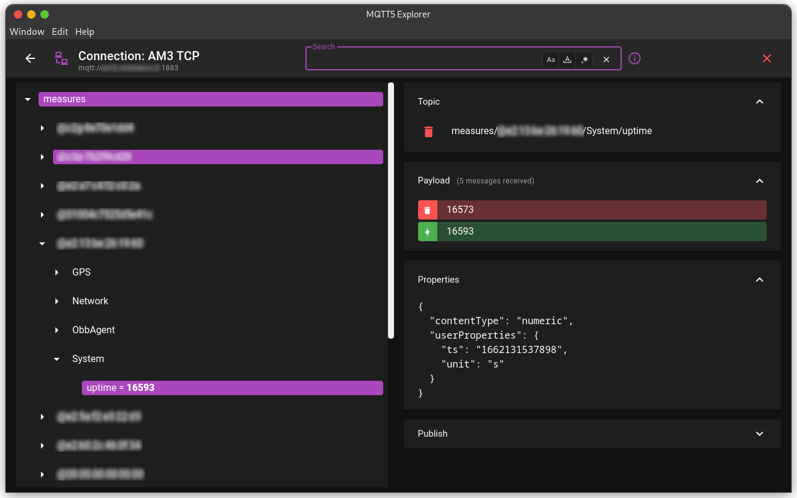
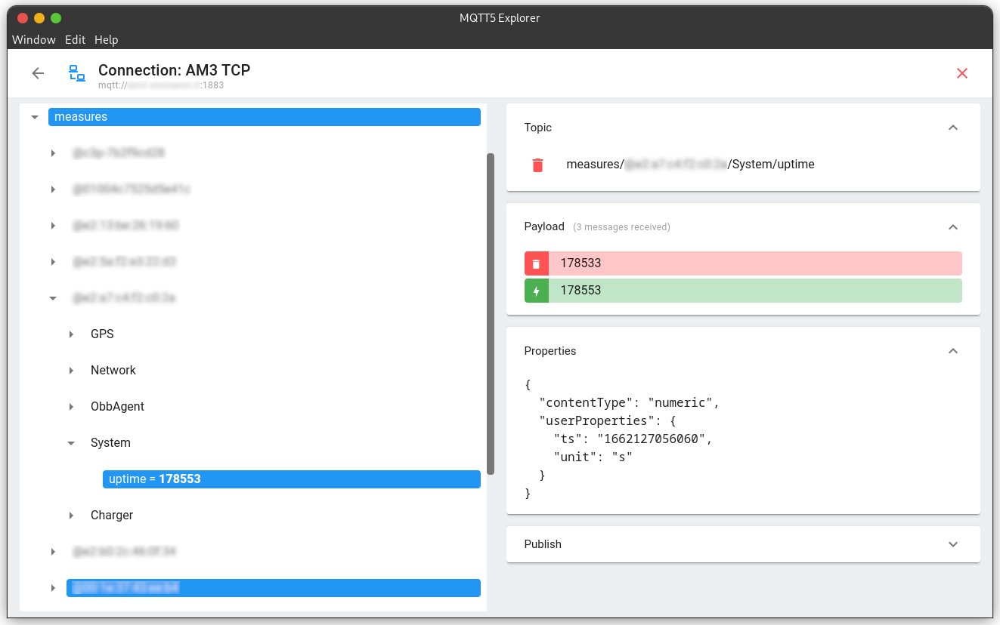

# MQTT5 Explorer

  

[](https://github.com/Omniaevo/mqtt5-explorer/issues) [](https://github.com/Omniaevo/mqtt5-explorer/actions)  [](https://github.com/Omniaevo/mqtt5-explorer/releases)  [](https://github.com/Omniaevo/mqtt5-explorer/blob/master/LICENSE) 

## About this project

The aim of this project is to bring the users a client app capable of making use of all the features of the version 5 of the MQTT protocol. The lack of any application that can offer the compatibility with the newer version of the protocol forced us to implement one to test the data of MQTT brokers workwise, why not to share this tool with others that may have the same issue?

> **NEWS!** You can find a complete rewrite and redesign of MQTT5 Expolorer [here](https://github.com/Omniaevo/mqtt5-explorer-go). The new project is based on **GoLang** (using **Wails**) instead of Electron, the UI has been updated to **Vue 3**. The *Go version* has the starting version set to *2.0.0* but, since the new project is not complete yet and it is primarily *vibe-coded* ([OpenCode + MiniMax M2.5](https://opencode.ai/)), it is not intended to replace this version of the app present in this repository. We'll be glad if you want to try it and give feedbacks on the new *Go version* of [MQTT5 Explorer](https://github.com/Omniaevo/mqtt5-explorer-go)!

## Screenshots

### Dark theme



### Light theme



## Downloads

<p>
  <a href='https://flathub.org/apps/io.github.Omniaevo.mqtt5-explorer'>
    
  </a>
</p>

<p>
  <a href="https://aur.archlinux.org/packages/mqtt5-explorer-bin">
    
  </a>
</p>

<p>
  <a href='https://github.com/Omniaevo/mqtt5-explorer/releases'>
    
  </a>
</p>

## Project setup

The app uses [Electron](https://www.electronjs.org/), [Vue 3](https://vuejs.org/), [Vuetify 4](https://vuetifyjs.com/), [Pinia](https://pinia.vuejs.org/) and [electron-vite](https://electron-vite.org/). You need [Node.js](https://nodejs.org/) 20 or newer.

```bash
npm install
```

Source layout:

- `src/main`: main process (window, MQTT client, settings, logger, notifications).
- `src/preload`: preload script. It exposes `window.api` to the renderer.
- `src/renderer`: Vue 3 interface. It has no access to Node.js.
- `src/shared`: code used by both main and renderer.

### Compiles and hot-reloads for development

```bash
npm run dev
```

### Generate app icons

```bash
npm run electron:icons
```

### Lint and format

```bash
npm run lint             # ESLint (flat config) + Prettier rules
npm run lint -- --fix    # Fix what can be fixed automatically
npm run format           # Prettier write
```

### Unit tests

[Vitest](https://vitest.dev/) tests live next to the code as `*.test.js`.

```bash
npm test             # Run once
npm run test:watch   # Watch mode
```

## Compiles and minifies for production

`electron-vite` builds the app into `out/`. `electron-builder` packages it into `dist_electron/`.

```bash
# Build only (no package)
npm run build
# Preview the built app
npm run preview
```

**N.B.**: the package scripts use **electron publish** when you pass `-p always`. In this case, a _.env_ file with the `GITHUB_TOKEN` environment variable set is required.

```bash
# Linux
npm run build:linux # Without publish
npm run build:linux -- -p always # With GitHub publish

# MacOS
npm run build:mac # Without publish
npm run build:mac -- -p always # With GitHub publish

# Windows
npm run build:win # Without publish
npm run build:win -- -p always # With GitHub publish

# Flatpak
# ⚠️ The flatpak and flatpak-builder packages need to be installed in order to build Flatpak bundles. ⚠️
npm run build:linux -- flatpak
# Install and run the flatpak package
flatpak install --user mqtt5-explorer-[VERSION]-linux-x86_64.flatpak && flatpak run com.omniaevo.mqtt5_explorer
```

## Customize configuration

Configuration files:

- `electron.vite.config.mjs`: build of the main, preload and renderer bundles.
- `electron-builder.yml`: packaging (AppImage, Flatpak, dmg, portable exe), output dir and publish target.
- `vitest.config.mjs`, `eslint.config.mjs`, `.prettierrc`: tests, lint and format.

See:

- [electron-vite Configuration Reference](https://electron-vite.org/config/).
- [Vite Configuration Reference](https://vite.dev/config/).
- [Vuetify Configuration Reference](https://vuetifyjs.com/en/introduction/why-vuetify/#feature-guides).
- [Electron Build Configuration Reference](https://www.electron.build/docs/configuration).

## Get involved

See:

- [The code of conduct](CODE_OF_CONDUCT.md).
- [The contribution guidelines](.github/contributing.md).

## Contributors

[](https://github.com/Omniaevo/mqtt5-explorer/graphs/contributors)
