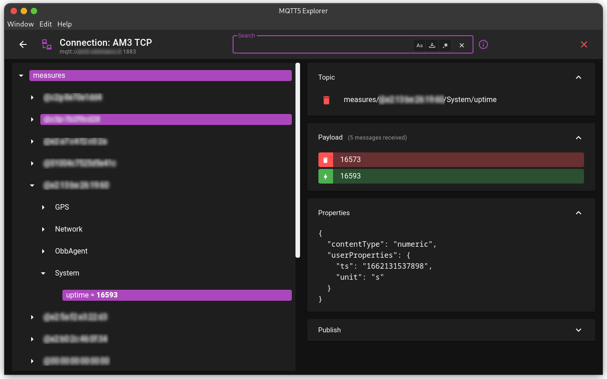

# MQTT5 Explorer

  

[](https://github.com/Omniaevo/mqtt5-explorer/issues) [](https://github.com/Omniaevo/mqtt5-explorer/actions)  [](https://github.com/Omniaevo/mqtt5-explorer/releases)  [](https://github.com/Omniaevo/mqtt5-explorer/blob/master/LICENSE) 

## About this project

The aim of this project is to bring the users a client app capable of making use of all the features of the version 5 of the MQTT protocol. The lack of any application that can offer the compatibility with the newer version of the protocol forced us to implement one to test the data of MQTT brokers workwise, why not to share this tool with others that may have the same issue?

## Screenshots

### Dark theme



### Light theme


## Downloads

<p>
  <a href='https://flathub.org/apps/io.github.Omniaevo.mqtt5-explorer'>
    
  </a>
</p>

<p>
  <a href="https://aur.archlinux.org/packages/mqtt5-explorer-bin">
    
  </a>
</p>

<p>
  <a href='https://github.com/Omniaevo/mqtt5-explorer/releases'>
    
  </a>
</p>

## Project setup

```bash
npm install
```

### Compiles and hot-reloads for development

```bash
npm run electron:serve
```

### Generate app icons

```bash
npm run electron:icons
```

### Lints and fixes files

```bash
npm run lint
```

## Compiles and minifies for production

**N.B.**: the build process includes **electron publish**, a _.env_ file with the `GITHUB_TOKEN` environment variable set is required.

```bash
# Linux
npm run electron:build -- --linux # Without publish
npm run electron:build -- --linux -p always # With GitHub publish

# MacOS
npm run electron:build -- --mac # Without publish
npm run electron:build -- --mac -p always # With GitHub publish

# Windows
npm run electron:build -- --win # Without publish
npm run electron:build -- --win -p always # With GitHub publish

# Flatpak
# ⚠️ The flatpak and flatpak-builder packages need to be installed in order to build Flatpak bundles. ⚠️
npm run electron:build -- --linux flatpak
# Install and run the flatpak package
flatpak install --user mqtt5-explorer-[VERSION]-linux-x86_64.flatpak && flatpak run com.omniaevo.mqtt5_explorer
```

## Customize configuration

See:

- [Vue Configuration Reference](https://cli.vuejs.org/config/).
- [Vuetify Configuration Reference](https://vuetifyjs.com/en/introduction/why-vuetify/#feature-guides).
- [Electron Build Configuration Reference](https://www.electron.build/configuration/configuration).

## Get involved

See:

- [The code of conduct](CODE_OF_CONDUCT.md).
- [The contribution guidelines](.github/contributing.md).

## Contributors

[](https://github.com/Omniaevo/mqtt5-explorer/graphs/contributors)
